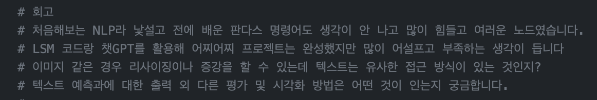

# AIFFEL Campus Online Code Peer Review Templete
- 코더 : 신지만
- 리뷰어 : 조대희


# PRT(Peer Review Template)
- [⭕️]  **1. 주어진 문제를 해결하는 완성된 코드가 제출되었나요?**
            
    
- [⭕️]  **2. 전체 코드에서 가장 핵심적이거나 가장 복잡하고 이해하기 어려운 부분에 작성된 
주석 또는 doc string을 보고 해당 코드가 잘 이해되었나요?**  

    > 주석으로 각 코드에 대한 설명이 있어 이해가 용이했다.     
        
- [⭕️]  **3. 에러가 난 부분을 디버깅하여 문제를 “해결한 기록을 남겼거나” 
”새로운 시도 또는 추가 실험을 수행”해봤나요?**
            
        
- [⭕️]  **4. 회고를 잘 작성했나요?**
    
    
        
- [⭕️]  **5. 코드가 간결하고 효율적인가요?**  
    - 전처리: 텍스트 데이터를 깔끔하게 전처리하기 위한 다양한 단계(약어 정규화, HTML 태그 제거, 불용어 제거 등)를 구현하였습니다.
    - 어텐션 메커니즘: 추상적 요약에 어텐션 메커니즘을 도입하여 성능 향상을 시도하였습니다.
    - 두 가지 방식의 요약: 추상적 요약과 추출적 요약 두 가지 방식을 모두 시도하였습니다.


# 참고 링크 및 코드 개선
```
개선점 및 제안:
데이터 양: 더 큰 데이터셋으로 모델을 훈련하면 성능 향상을 기대할 수 있습니다.

하이퍼파라미터 튜닝: 모델의 하이퍼파라미터(예: 임베딩 차원, LSTM의 hidden size, 배치 크기, 학습률 등)를 튜닝하여 최적의 조합을 찾아볼 수 있습니다.

Bidirectional LSTM: 인코더에서 Bidirectional LSTM을 사용하여 과거와 미래의 정보를 모두 활용할 수 있게 해보세요.

정규화: 모델이 과대적합을 방지하기 위해 더 많은 드롭아웃 또는 L1, L2 정규화를 적용해 볼 수 있습니다.

데이터 확장 (Data Augmentation): 기존 데이터의 문장 순서를 바꾸거나, 동의어를 사용하여 데이터를 확장하여 모델을 훈련시켜 볼 수 있습니다.

평가 지표: BLEU, ROUGE와 같은 요약 평가 지표를 사용하여 모델의 성능을 정량적으로 평가해 볼 수 있습니다.

전이 학습 (Transfer Learning): 사전 훈련된 Word Embeddings(예: Word2Vec, GloVe)를 사용하여 모델의 성능을 향상시킬 수 있습니다.

추출적 요약 개선: 현재는 SMMMA를 사용하여 추출적 요약을 구현하였지만, 다른 모델(예: BERT)을 사용하여 더 정확한 요약을 생성할 수 있습니다.
```
