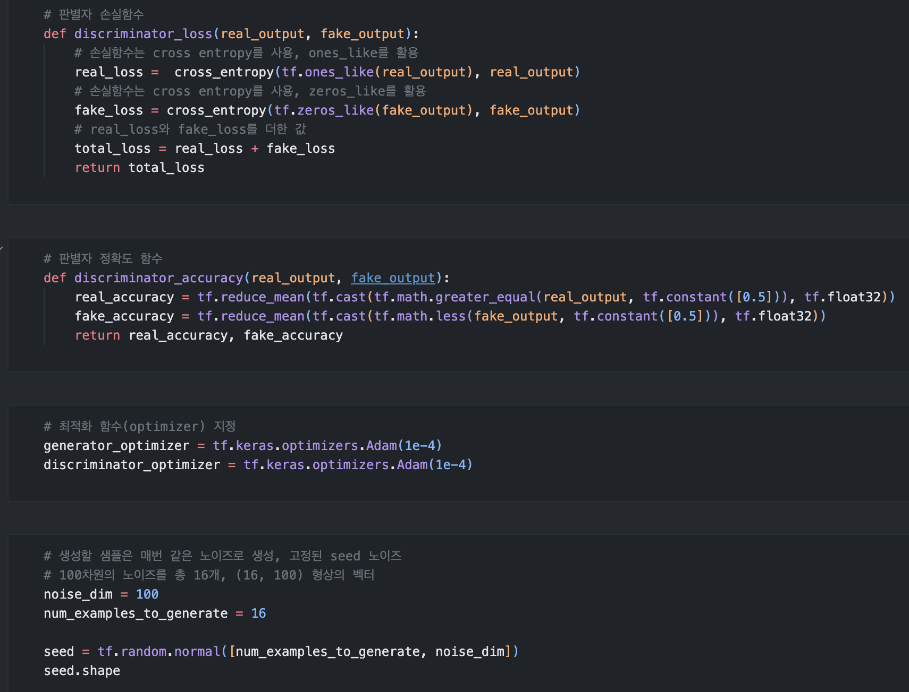
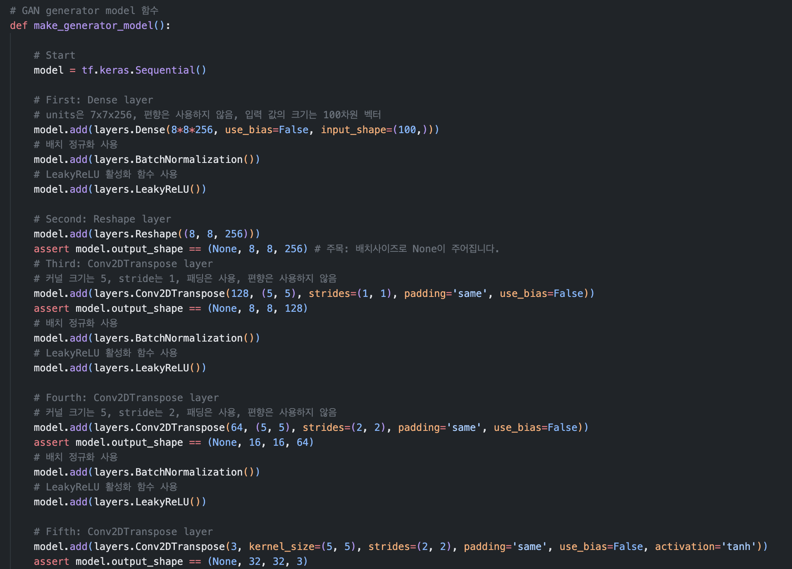
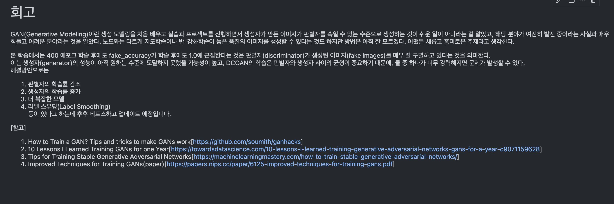
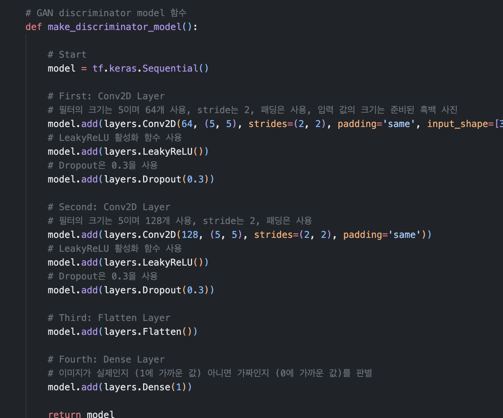

# AIFFEL Campus Online Code Peer Review Templete
- 코더 : 신지만
- 리뷰어 : 조대희


# PRT(Peer Review Template)
- [⭕️]  **1. 주어진 문제를 해결하는 완성된 코드가 제출되었나요?**
            
<br>

- [⭕️]  **2. 전체 코드에서 가장 핵심적이거나 가장 복잡하고 이해하기 어려운 부분에 작성된 
주석 또는 doc string을 보고 해당 코드가 잘 이해되었나요?**
    

        
<br>

- [⭕️]  **3. 에러가 난 부분을 디버깅하여 문제를 “해결한 기록을 남겼거나” 
”새로운 시도 또는 추가 실험을 수행”해봤나요?**



<br>

- [⭕️]  **4. 회고를 잘 작성했나요?**
    


<br>

- [⭕️]  **5. 코드가 간결하고 효율적인가요?**



<br>

# 참고 링크 및 코드 개선
```
생성자와 판별자의 구조:

현재 생성자와 판별자는 깊지 않은 구조를 가지고 있습니다. 모델의 깊이를 늘려 성능을 향상시킬 수 있습니다.
또한, 필터의 수나 커널의 크기 등을 조절해 보면서 최적의 구조를 찾을 수 있습니다.
손실함수:

현재는 기본적인 GAN 손실함수를 사용하고 있습니다. WGAN, WGAN-GP, LSGAN 등의 다양한 GAN의 손실 함수를 사용해보면 성능이 향상될 수 있습니다.
학습률 및 옵티마이저:

학습률이나 배치 크기 등의 하이퍼파라미터를 조절해 보면서 성능을 최적화할 수 있습니다.
Adam 옵티마이저 외에 RMSprop 등 다른 옵티마이저를 사용해볼 수 있습니다.
배치 정규화:

생성자와 판별자의 각 레이어에 배치 정규화를 추가하여 학습을 더 안정적으로 만들 수 있습니다.
데이터 전처리:

CIFAR-10 데이터의 경우, 추가적인 데이터 전처리나 확장(Data Augmentation)을 적용하여 데이터의 다양성을 높일 수 있습니다.
학습 과정의 시각화:

학습 과정에서 생성된 이미지나 손실 그래프를 시각화하여 학습의 진행 상황을 더 잘 파악할 수 있게 만들면 좋습니다.
정규화 및 드롭아웃:

과적합을 방지하기 위해 판별자에 드롭아웃 레이어를 추가할 수 있습니다.
```
